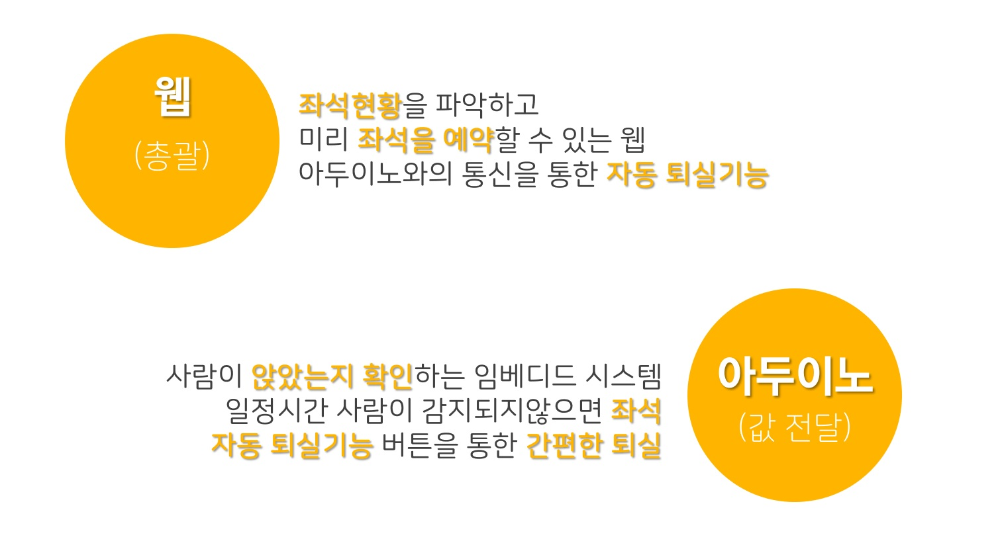
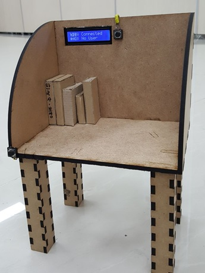
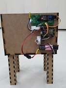

### 녹차빙수

도서관 열람실 자리 관리 플랫폼

#### 1.현재추세

공공 도서관이 계속 늘어나는 추세이며, 이에 따라 도서관 열람실도 계속 늘어나고 있다.

####  2.설문조사

10월 20일 부터 21일 까지 동탄 이음터 도서관에서 설문조사를 실시한 결과 응답자 106명 중 참여자 66%가 빈자리 임에도 사용중이라고 떠서 도서관 열람실을 사용하는데 어려움이 있다고 답했습니다.

#### 3.녹차빙수 플랫폼이 가지고 있는 기능

1. 사람이 감지되지 않은 상태가 일정 시간 지속되면 자동으로 퇴실되는 시스템
2. 사람이 앉아있음을 감지하는 시스템
3. LCD를 통해 자신이 예약한 자리 확인
4. 버튼을 통한 간편한 퇴실

#### 4.HW의 모습
{: refdef: style="text-align: center;"}

{: refdef}

