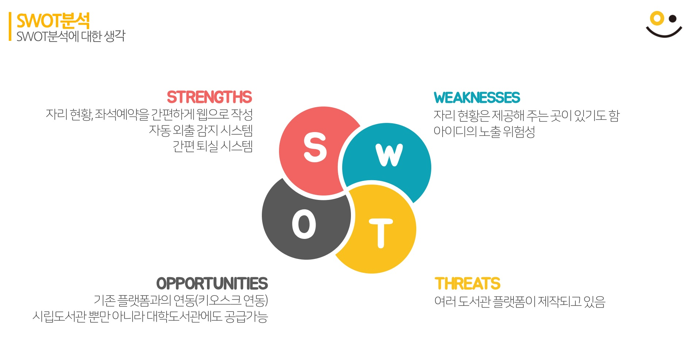
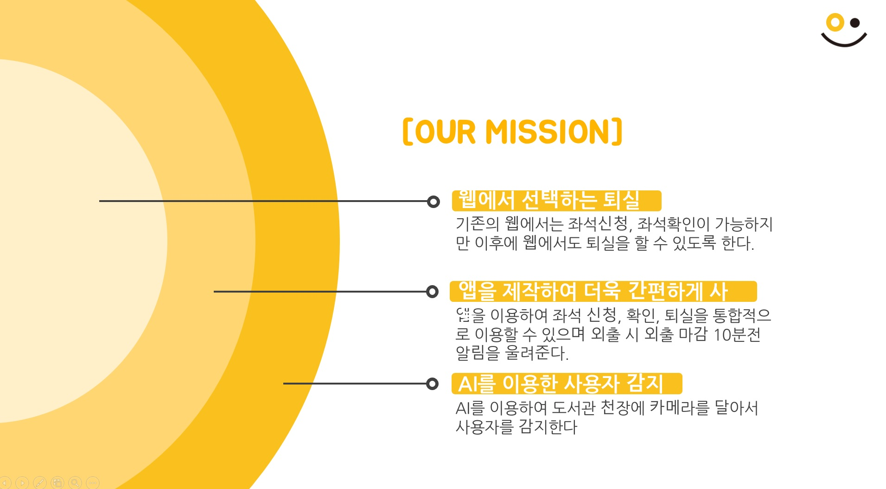

### 녹차빙수

도서관 열람실 자리 관리 플랫폼

#### 1.현재추세

공공 도서관이 계속 늘어나는 추세이며, 이에 따라 도서관 열람실도 계속 늘어나고 있다.

####  2.설문조사

10월 20일 부터 21일 까지 동탄 이음터 도서관에서 설문조사를 실시한 결과 응답자 106명 중 참여자 66%가 빈자리 임에도 사용중이라고 떠서 도서관 열람실을 사용하는데 어려움이 있다고 답했습니다.

#### 3.녹차빙수 플랫폼이 가지고 있는 기능

1. 사람이 감지되지 않은 상태가 일정 시간 지속되면 자동으로 퇴실되는 시스템
2. 사람이 앉아있음을 감지하는 시스템
3. LCD를 통해 자신이 예약한 자리 확인
4. 버튼을 통한 간편한 퇴실

#### 4.HW 구성

1. Nodemcu 보드를 사용하여 WiFi에 연결, 파이어 베이스 데이터베이스에 연결
2. LCD 디스플레이를 통해 네트워크 연결 상태, 사용자 예약 상태, 사용자 아이디, 현재 책상 상태를 확인할 수 있음.
3. LCD 옆에 부착된 스위치를 통해 퇴실할 때 간편하게 퇴실할 수 있음
4. 책상 모서리에 부착된 스위치를 통해 현재 사용자가 책상에 있는지, 없는지를 확인할 수 있음 (처음에는 PIR센서를 사용하여 확인하였으나, PIR센서가 움직이는 모션만 감지하기 때문에 가만히 앉아있는 경우 측정을 할 수 없었다. 따라서 일반 스위치를 통해 나타내었으며, 추후 영상인식 혹은 다른 방법으로 개선할 것이다.)
5. Arduino.ide에서 작성

#### 5.SW 구성

1. 도서관 열람실 좌석 현황 확인 가능
2. 로그인 기능
3. 도서관 열람실 자리 선택, 예약 기능
4. firebase로 데이터베이스 구현
5. node.js, vue.js로 웹 사이트 제작

#### 6.사용시장 선정
TAM(총 유효시장) -> 전국의 도서관 열람실

SAM(유효시장) -> 수도권 지역

SOM(수익시장) -> 시립 도서관, 대학 도서관

#### 7.사용, 구매 고객

사용고객은 도서관 이용자가 될 것이며, 구매고객은 도서관 관할 지자체 혹은 대학교가 될 것이다.

#### 8.SWAT 분석

#### 9.기존과 대비되는 강점

기존의 키오스크 = 100 ~ 400 만원의 설치비용, 고장 시 열람실 배정 서비스 마비

녹차빙수 = 모듈제작비용 : 6000원(정가), 고장 시 개별 수리 가능, 무궁무진한 발전 가능성

#### 10.마케팅 방법

#### EOD. 개선 사항

